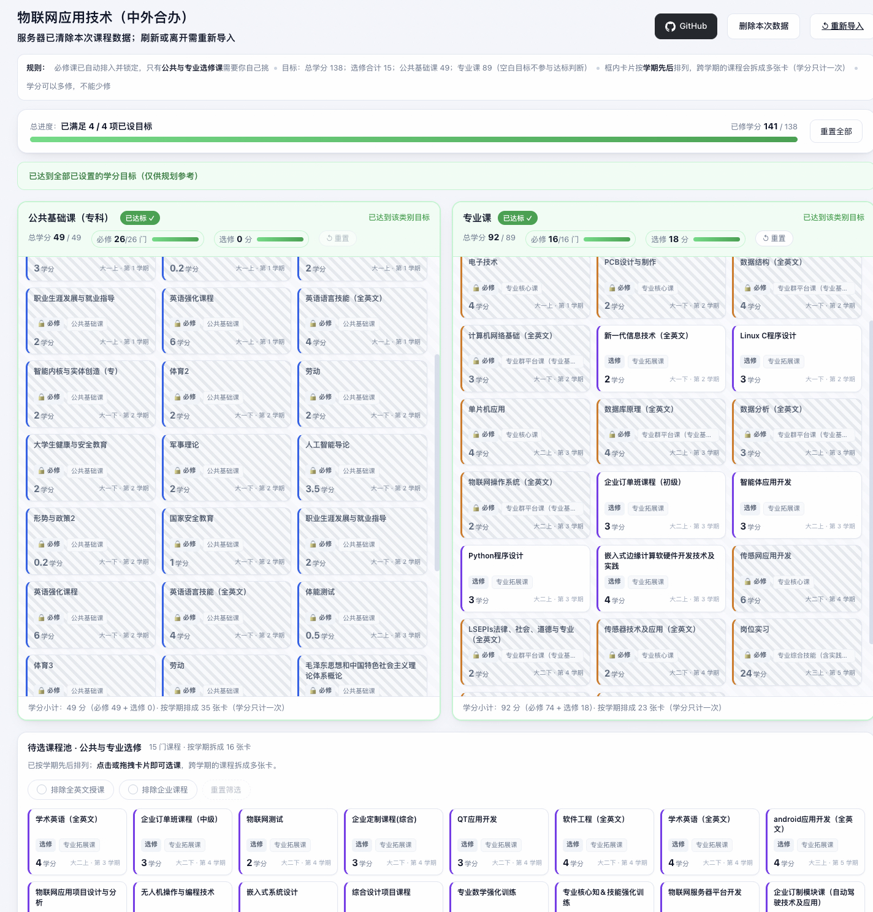
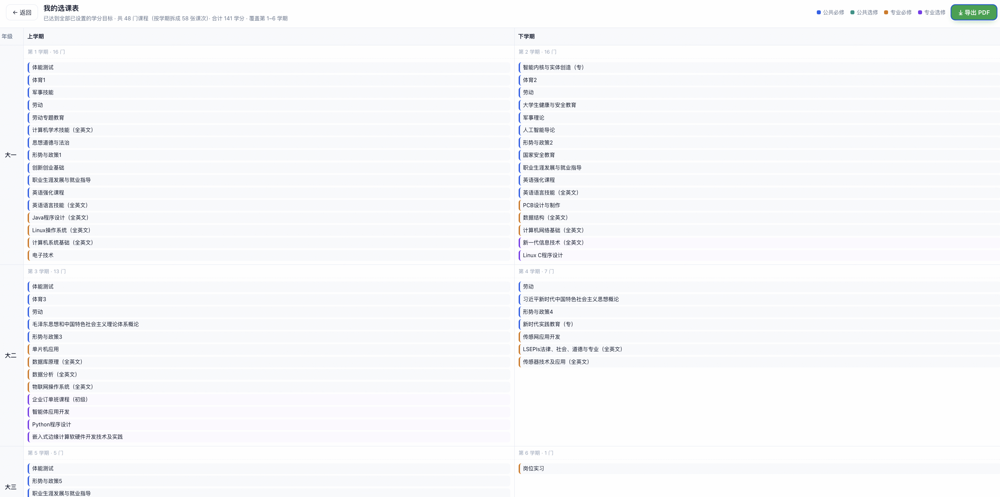

# EnoughPoints

> 一个用来规划课程、计算学分并生成学期排班表的小工具。  
> A course planning tool for calculating credits and generating semester schedules.

**EnoughPoints 是一个 Vibe-Coding 项目。** made by **Akari悦酱**

**仅供个人娱乐，请勿用于商业用途！！开源遵循MIT License**

**本项目只使用广州职业技术大学（GPU大学）的课表测试过，其他学校的理论上能通用，只要是excel表格，有对应的信息就行**

本项目的代码均由 AI 编写、修改与协助维护。  
Yes — basically, the AI writes the code, and I tell it what I want.

---

## 🌐 在线示例 / Demo

前端示例网页：

👉 [https://akariyuechan.github.io/EnoughPoints](https://akariyuechan.github.io/EnoughPoints)

---

## ✨ 功能 / Features

### 1. 课程卡片与学分计算

将每一门课程显示为独立卡片。

对于选修课，可以通过点击或拖动的方式进行选择，并自动计算：

- 已选择的学分
- 还需要修多少学分
- 当前课程选择情况

### 2. 自动生成学期课表

完成选课后，可以根据已选择的课程自动生成各学期需要修读的课程安排。

### Screenshots





---

## 📦 依赖 / Requirements

### 环境

- Python 3.10+
- 推荐 Python 3.12
- Git

### Python Dependencies

```text
openpyxl==3.1.5
xlrd==2.0.2
et-xmlfile==2.0.0
defusedxml==0.7.1
```

完整依赖请以项目中的 `requirements.txt` 为准。

---

# 🚀 使用方法 / How to Use

## 一句话版本 / Agent Installation

如果你正在使用支持网页访问、终端和文件操作的 AI Agent，可以直接跟它说：

> 访问这个项目的 GitHub 页面，克隆 EnoughPoints 到本地，安装并配置运行环境及所需依赖，然后运行 start 脚本。

项目地址：

[https://github.com/akariyuechan/EnoughPoints](https://github.com/akariyuechan/EnoughPoints)

---

# 🛠️ 人工安装 / Manual Installation

## 01 / 安装 Python 与 Git

推荐使用：

- Python 3.12
- Git

### Windows

打开 **CMD** 或 **PowerShell**。

安装 Python 3.12：

```powershell
winget install -e --id Python.Python.3.12 --override "InstallAllUsers=0 PrependPath=1 Include_pip=1 Include_test=0"
```

安装 Git：

```powershell
winget install --id Git.Git -e --source winget
```

检查是否安装成功：

```powershell
python --version
pip --version
git --version
```

如果 `python` 命令无法使用，也可以尝试：

```powershell
py --version
```

---

### macOS

推荐使用 [Homebrew](https://brew.sh/) 管理环境。

安装 Homebrew：

```bash
/bin/bash -c "$(curl -fsSL https://raw.githubusercontent.com/Homebrew/install/HEAD/install.sh)"
```

检查 Homebrew：

```bash
brew --version
```

安装 Python 3.12：

```bash
brew install python@3.12
```

安装 Git：

```bash
brew install git
```

检查环境：

```bash
python3.12 --version
pip3.12 --version
git --version
```

---

## 02 / 克隆项目

在终端中执行：

```bash
git clone https://github.com/akariyuechan/EnoughPoints.git
cd EnoughPoints
```

当然，你也可以直接前往项目的 **Releases** 页面手动下载。

---

## 03 / 安装依赖

进入 EnoughPoints 项目目录后执行：

### Windows

```powershell
pip install -r requirements.txt
```

如果你的环境使用 `py`：

```powershell
py -m pip install -r requirements.txt
```

### macOS

```bash
pip3.12 install -r requirements.txt
```

或者：

```bash
python3.12 -m pip install -r requirements.txt
```

---

## 04 / 运行 EnoughPoints

### Windows

双击：

```text
start.bat
```

或者在终端运行：

```powershell
.\start.bat
```

### macOS

双击：

```text
start.command
```

如果 macOS 阻止执行，可以先给予脚本执行权限：

```bash
chmod +x start.command
```

然后运行：

```bash
./start.command
```

如果系统因安全设置阻止运行，请根据系统提示为脚本授予相应权限。

---

## 🌐 打开网页

程序启动后，在浏览器中访问：

[http://127.0.0.1:8765](http://127.0.0.1:8765)

默认端口：

```text
8765
```

如果端口已经被其他程序占用，可以修改 `start` 脚本中的端口，例如：

```text
--port 6666
```

端口范围为：

```text
1 - 65535
```

建议尽量选择未被其他程序占用的高位端口。

---

# 📝 待完善 / To-Do List

- [ ] 支持导入 PDF
- [ ] 调用 OCR 自动识别 PDF / 图片中的课程信息
- [ ] 支持 TXT / Word 等文本自动转换与导入
- [ ] 自动抓取教务系统网页并导入完整课程表
- [ ] 自动计算选修课所需学分
- [ ] 在教务系统抽风、学分算不明白的时候帮你重新算一遍
- [ ] 根据选择的课程，通过自动化脚本辅助抢课
- [ ] 增加更多语言支持

---

# 待解决 / To Be Solved

1. **暂未适配深色模式，因为前途已经很黑暗了。**

2. **暂未解决挂科后的课表自动适配问题。**  

3. **暂未解决大专毕业后，部分企业招聘要求本科及以上学历的问题。**  

---

# 🙏 致谢 / Acknowledgements

EnoughPoints 的部分功能使用了以下开源项目：

- [openpyxl](https://openpyxl.readthedocs.io/)
- [et-xmlfile](https://pypi.org/project/et-xmlfile/)
- [xlrd](https://xlrd.readthedocs.io/)
- [defusedxml](https://github.com/tiran/defusedxml)
- [xlwt](https://pypi.org/project/xlwt/)

感谢这些项目的开发者和贡献者，为 Python 生态提供优秀的文件处理、兼容性与安全支持。

---

## 🤖 关于 Vibe-Coding

EnoughPoints 是一个 **Vibe-Coding 开源项目**。

参与过本项目代码编写、修改或协助开发的 AI 模型包括：

```text
DeepSeek V4.1-Flash / V4.0-Pro
ChatGPT-6 Astra / GPT-5.6 Luna
Kimi K3
```

感谢各位 AI 天天听我这个小白乱指挥、瞎提要求，然后继续努力改代码。

---

# 📜 开源许可证 / License

EnoughPoints 项目自身编写的源代码采用 **MIT License** 发布。

你可以在遵守 MIT License 条款的前提下：

- 使用本项目
- 复制本项目
- 修改本项目
- Fork本项目
- **不得将本项目用于商业用途，如发生商业纠纷，本项目一概不负任何责任！！**

项目使用的第三方组件分别适用其各自的原始开源许可证，包括但不限于：

- MIT License
- BSD-style License
- Python Software Foundation License
- LGPL-2.1 及部分历史代码对应的许可证声明

第三方软件的原始许可证、版权声明及作者信息均保留在项目的：

```text
vendor/
```

以及相应的：

```text
*.dist-info
```

目录或文件中。

第三方代码 **不适用 EnoughPoints 项目自身的 MIT License**，请以各组件随附的原始许可证文件为准。

完整许可证信息及第三方软件声明请查看：

- [`LICENSE`](./LICENSE)
- [`THIRD_PARTY_LICENSES.md`](./THIRD_PARTY_LICENSES.md)

---

## EnoughPoints

Released under the **MIT License**.

For full license information and third-party notices, please see:

- `LICENSE`
- `THIRD_PARTY_LICENSES.md`

---

> Made with AI, Vibes, and questionable amounts of trial and error.
